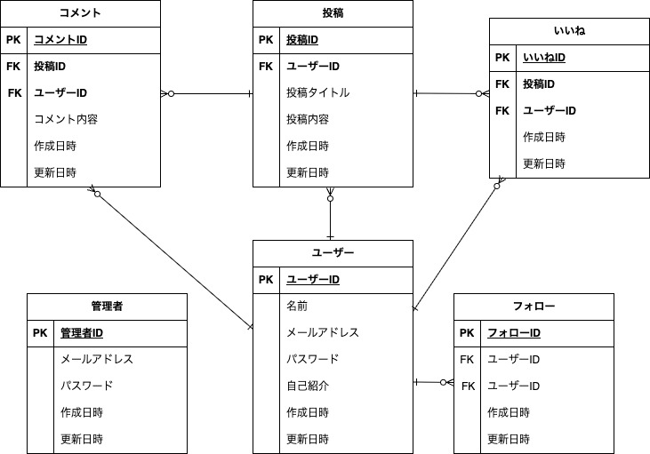

# Mango Connect

## サイト概要
### サイトテーマ
規格外マンゴーの情報を投稿し、欲しい人とつながるSNS。  

### テーマを選んだ理由
私の地元である宮崎県はマンゴーの名産地ですが、高級品として扱われるため、一般の人にとっては手が出しづらい存在でもあります。一方で、形や傷の程度によっては規格外品として販売されるものもあれば、それ以下のものは食べられるのに市場に出せない現状があります。実家がマンゴー農家のため、この問題を身近に感じてきました。スーパーなどの店舗で販売できない規格外マンゴーの情報を共有し、まだ美味しく食べられるマンゴーを必要としている人とつなげることで、手頃な価格で楽しめる機会を提供しつつ、フードロス削減や地元の生産者の助けになればと思い、このテーマを選びました。

### ターゲットユーザ
- 宮崎県産マンゴーに興味があるが、高級品なので普段は買えない人
- 規格外でも気にせず、美味しく食べる事が出来れば十分だと考える人
- 規格外マンゴーを安く仕入れて、スイーツやドリンクに活用したい飲食店
- 原価を抑えつつ、マンゴーを使ったメニューを提供したい飲食店

### 主な利用シーン
- 規格外マンゴーを販売したいが、販路がない時
- スーパーや市場で扱えないマンゴーを直接販売したい時
- スイーツやドリンクの原材料として、高級マンゴーを手頃な価格で仕入れたい時
- 家庭で食べる用に、規格外マンゴーを探しているとき
- 自宅でスムージーやデザートを作るために 訳ありマンゴーを安く買いたい時

## 機能一覧
- ゲストログイン機能
- 会員登録・ログイン・ログアウト機能（Devise）
- 投稿機能（画像・テキスト投稿）
- 投稿検索機能（完全一致・前方一致・後方一致・部分一致に対応）
- ユーザー検索機能（完全一致・前方一致・後方一致・部分一致に対応）
- 投稿のいいね機能
- いいね一覧表示機能
- フォロー・フォロワー機能
- コメント機能
- 投稿のソート機能（新着順・いいね数順など）
- ユーザー管理機能（管理者側）
- 投稿管理機能（管理者側）

## 設計書
- ER図

## 開発環境
- OS：Linux(CentOS)
- 言語：HTML,CSS,JavaScript,Ruby,SQL
- フレームワーク：Ruby on Rails
- JSライブラリ：jQuery
- IDE：Cloud9
​
## 使用素材
以下のフリー素材を使用しています。  

### **画像素材**  
- **ぱくたそ**（https://www.pakutaso.com/#google_vignette）  
- **O-DAN**（https://o-dan.net/ja/）  

### **アイコン素材**  
- **FontAwesome**（https://fontawesome.com/icons） 
　